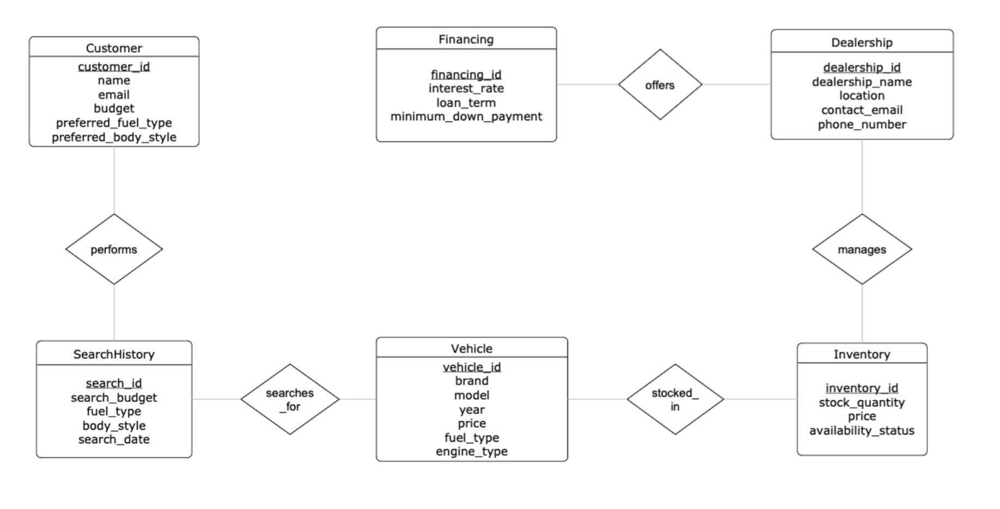

# AutoSelect
**Intelligent Car Recommendation & Inventory Management System**
CSDS 341 · Introduction to Database Systems · Spring 2026

---

## Overview
AutoSelect is a relational database application for browsing vehicles,
checking dealership inventory, and exploring financing options.
Built on PostgreSQL with a Python CLI and Flask web interface.

---

## Tech Stack
- **Database** — PostgreSQL 14
- **Backend** — Python · Flask · psycopg2
- **Frontend** — HTML · CSS · JavaScript
- **Data** — 2023 Kaggle Cars Dataset
- **Tools** — IntelliJ · pgAdmin · Git

---

## Database Schema
6 tables, all in BCNF:

| Table | Primary Key |
|---|---|
| Vehicle | vehicle_id |
| Dealership | dealership_id |
| Inventory | vehicle_id + dealership_id (Composite) |
| Customer | customer_id |
| Financing | financing_id |
| SearchHistory | search_id |

---

## ER Diagram



> **Key design decision:** `Inventory` uses a composite primary key `(vehicle_id, dealership_id)` — not a surrogate `inventory_id` — to correctly resolve the M:N relationship between Vehicle and Dealership without redundancy. All tables satisfy BCNF.

---

## Setup

### 1. Install dependencies
```bash
pip install psycopg2-binary flask pandas
```

### 2. Create the database
```bash
psql -U your_username -d postgres -f sql/autoselect_setup.sql
```

### 3. Load vehicle data
```bash
python python/load_kaggle_data.py --file data/2023\ Car\ Dataset.csv
```

### 4. Run the CLI
```bash
python python/cli.py
```

### 5. Run the Web UI
```bash
python python/app.py
# open http://localhost:5050
```

---

## Team
| Name | Contributions |
|---|---|
| Michael | Schema design, BCNF, easy queries, Demo 1–3 |
| Jani | Hard queries, Relational Algebra & TRC, Demo 4–6 |
| Dhoops | Admin ops, window functions, data loader, Web UI, Demo 7–10 |
